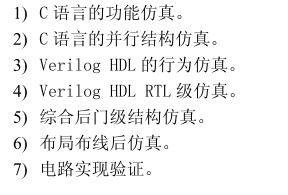
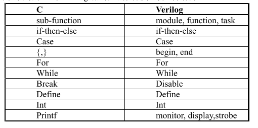
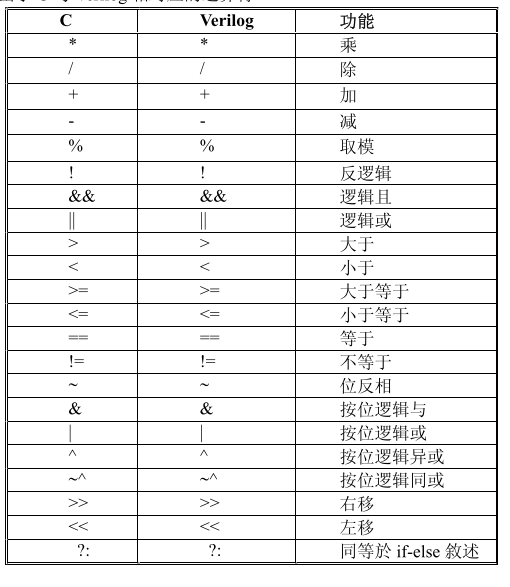

### Verilog 笔记

**目录：**

一、基本概念

二、Verilog HDL设计方法概述

#### 一、基本概念

1.多次仿真

2.C与verilog相对应的关键词与控制结构

3.对应的运算符

4.为什么要设计专用的信号处理电路:

以专用微处理器芯片为中心来构成算法所需电路设计周期短，可利用资源多，但是速度能耗体积等性能受到该微处理器芯片和外围电路的限制；

用高密度的FPGA来构成算法所需电路，他的基本结构决定了对某一种特殊应用，性能不如专用的ASIC电路；

采用专用ASIC（利用现成的微处理器IP核或者特殊应用设计的微处理器核，并结合专门设计的告诉运算电路），量体裁衣，性能优越，但是设计周期和制造周期长，投片成本高；

5.为什么要用硬件描述语言来设计复杂的算法逻辑电路：

硬件描述语言易于理解、维护、调试电路速度快，在复杂电路描述方面有较大优势，有许多易于掌握的仿真、综合和布局布线的哦工具，还可以利用C语言配合HDL来仿真；

6.为什么在算法逻辑电路的设计中需要用 C 语言和硬件描述语言配合使用来提高设计效率：

C语言灵活查错能力强，还可以通过PLI编写自己的系统任务直接与硬件仿真器结合使用，且可应用在许多领域，有可靠的编译环境，缺陷较少，但是在电路描述能力上较弱，这一点HDL刚好可以补足；

#### 二、Verilog HDL设计方法概述

1.软核、硬核与固核

功能经过验证、可综合的、实现后的电路结构总门数在5000门以上的verilog模型称之为“软核”；

在FPGA上实现，经验证是正确的总门数在5000以上的电路结构编码文件称之为“固核”；

在莫一种专用集成电路工艺（ASIC）器件上实现的经验证是正确的总门数在5000门以上的电路结构掩膜称之为“硬核”；

#### 三、

