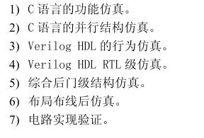
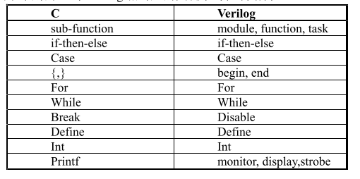
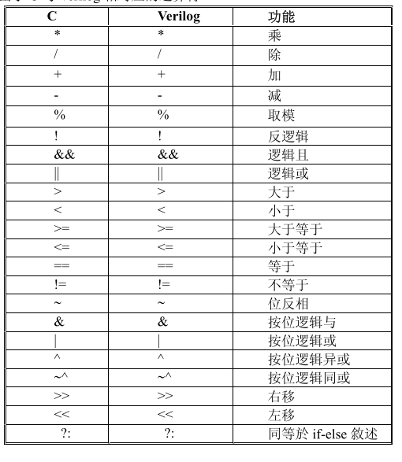
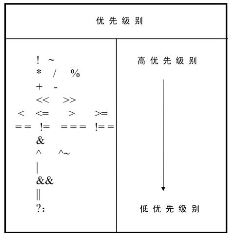
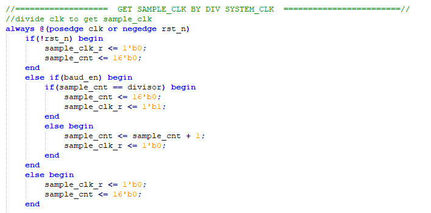
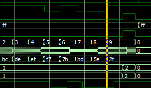
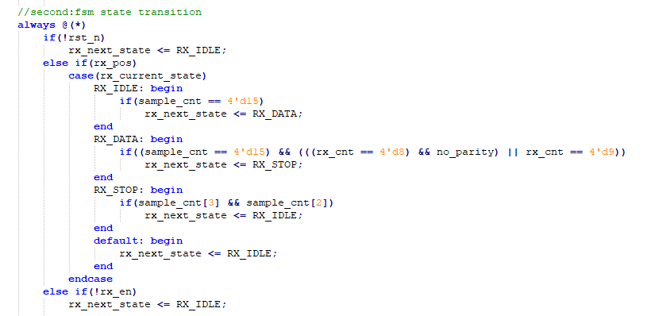
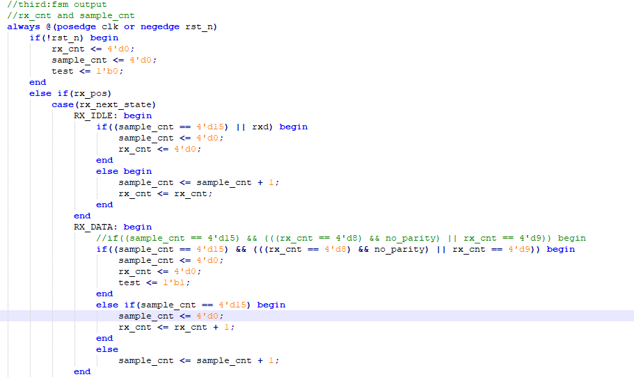

### Verilog 笔记

**目录：**

一、基本概念

二、Verilog HDL设计方法概述

三 、基本语法

#### 一、基本概念

1.多次仿真

2.C与verilog相对应的关键词与控制结构

3.对应的运算符

4.为什么要设计专用的信号处理电路:

以专用微处理器芯片为中心来构成算法所需电路设计周期短，可利用资源多，但是速度能耗体积等性能受到该微处理器芯片和外围电路的限制；

用高密度的FPGA来构成算法所需电路，他的基本结构决定了对某一种特殊应用，性能不如专用的ASIC电路；

采用专用ASIC（利用现成的微处理器IP核或者特殊应用设计的微处理器核，并结合专门设计的告诉运算电路），量体裁衣，性能优越，但是设计周期和制造周期长，投片成本高；

5.为什么要用硬件描述语言来设计复杂的算法逻辑电路：

硬件描述语言易于理解、维护、调试电路速度快，在复杂电路描述方面有较大优势，有许多易于掌握的仿真、综合和布局布线的哦工具，还可以利用C语言配合HDL来仿真；

6.为什么在算法逻辑电路的设计中需要用 C 语言和硬件描述语言配合使用来提高设计效率：

C语言灵活查错能力强，还可以通过PLI编写自己的系统任务直接与硬件仿真器结合使用，且可应用在许多领域，有可靠的编译环境，缺陷较少，但是在电路描述能力上较弱，这一点HDL刚好可以补足；

#### 二、Verilog HDL设计方法概述

1.软核、硬核与固核

功能经过验证、可综合的、实现后的电路结构总门数在5000门以上的verilog模型称之为“软核”；

在FPGA上实现，经验证是正确的总门数在5000以上的电路结构编码文件称之为“固核”；

在莫一种专用集成电路工艺（ASIC）器件上实现的经验证是正确的总门数在5000门以上的电路结构掩膜称之为“硬核”；

#### 三、基本语法

1.优先级：

#### 七、FSM设计与代码规范

1.门控时钟比较危险，在设计中尽量少用，模块中设计使用主时钟来统一时钟；

2.FPGA中多使用独热编码：

独热编码即 One-Hot 编码，又称一位有效编码，其方法是使用N位状态寄存器来对N个状态进行编码，每个状态都由他独立的寄存器位，并且在任意时候，其中只有一位有效。虽然使用较多的触发器，但由于状态译码简单，可减少组合逻辑且速度较快， 这种编码方式还易于修改，增加状态或改变状态转换条件都可以在不影响状态机的其它部分的情况下很方便地实现。另外，它的速度独立于状态数量。与之相比，压缩状态编码在状态增加时速度会明显下降。

二进制编码、格雷码编码使用最少的触发器，消耗较多的组合逻辑，而独热码编码反之。独热码编码的最大优势在于状态比较时仅仅需要比较一个位，从而一定程度上简化了译码逻辑。虽然在需要表示同样的状态数时，独热编码占用较多的位，也就是消耗较多的触发器，但这些额外触发器占用的面积可与译码电路省下来的面积相抵消。

在CPLD中，由于器件拥有较多的地提供组合逻辑资源，所以CPLD多使用二进制编码或格雷码，而FPGA更多地提供触发器资源，所以在FPGA中多使用独热码编码。

3.模块使能的写法：

错误写法：

在后续的always块中利用mclk的边沿触发，对时钟树而言不利于后续的综合时钟优化；

正确应该是以系统时钟边沿为触发条件，将使能作为判断条件；

4.状态机必须要有自启动机制，即在case中添加default；在状态机的设计中逻辑尽量清楚，删除不必要的状态；删除冗余语句，如无必要，勿增实体；

5.在always块中的时序电路，注意判断条件之间的逻辑关系，控制变量的值不应该只是局限在0与1，未知态与高阻态也要考虑在内，例如本来最后一个begin end块中加了判断条件（！baud_en），不太需要，假如baud_en采到了亚稳态也要保证这个块执行

6.因为next_state 与 current_state之间是组合逻辑，所以在RX_DATA向RX_STOP转移的过程中，在RX_DATA状态机下，那个sample_cnt与rx_cnt清零的语句块不会被执行；

